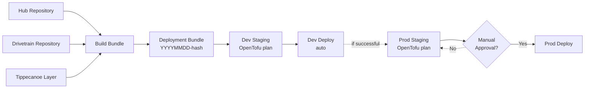

# Ridelines Frame

The infrastructure orchestration layer that powers the Ridelines GPS activity visualization ecosystem. Frame provides centralized infrastructure management, deterministic deployments, and environment orchestration using Infrastructure as Code principles.

## Overview

Ridelines Frame is the deployment orchestration component that manages the entire Ridelines ecosystem. It creates immutable deployment bundles containing all artifacts and infrastructure code, implements a staging/production promotion workflow, and handles AWS infrastructure provisioning using OpenTofu/Terraform.

### Key Features

- **📦 Deployment Bundles**: Immutable containers with all artifacts and infrastructure
- **🔄 Deterministic Deployments**: Same bundle promoted from dev → prod
- **🎯 Staging Workflow**: Review terraform plans before deployment
- **🌍 Multi-Environment**: Separated dev and prod with promotion path
- **⚡ Automated Pipeline**: GitHub Actions with manual production approval
- **🔒 Security-First**: IAM roles, OIDC authentication, and least privilege
- **📊 Full Traceability**: Track exact commits deployed to each environment

## Deployment Sequence



### Deployment Flow

1. **Component Updates**: When Hub, Drivetrain, or Tippecanoe repositories publish new containers
2. **Bundle Build**: Automatically combines all artifacts into an immutable deployment bundle
3. **Dev Staging**: Creates a prerelease with OpenTofu plan for development environment
4. **Dev Deploy**: Automatically deploys the staged release to development
5. **Prod Staging**: If dev deployment succeeds, creates a prerelease with OpenTofu plan for production
6. **Manual Approval**: Human review of the production prerelease is required
7. **Prod Deploy**: Upon approval, deploys the same bundle to production environment

## Technology Stack

- **Infrastructure as Code**: OpenTofu (Terraform) 1.8+
- **Cloud Platform**: AWS (S3, CloudFront, Lambda, Route53, ACM)
- **Container Registry**: GitHub Container Registry (ghcr.io)
- **CI/CD**: GitHub Actions with reusable workflows
- **Deployment Tracking**: GitHub Releases (prerelease = staging)
- **Security**: IAM roles, OIDC authentication

## Project Structure

```
frame/
├── .github/workflows/          # Deployment automation
│   ├── build-bundle.yml       # Creates deployment bundles
│   ├── base-stage.yml         # Reusable staging workflow
│   ├── base-deploy.yml        # Reusable deployment workflow
│   ├── dev-stage.yml          # Dev staging trigger
│   ├── dev-deploy.yml         # Dev deployment trigger
│   ├── prod-stage.yml         # Prod staging trigger
│   └── prod-deploy.yml        # Prod deployment trigger
├── environments/              # Environment configurations
│   ├── dev/                  # Development environment
│   └── prod/                 # Production environment
└── modules/                  # Reusable infrastructure modules
    ├── website/              # Static website hosting
    ├── drivetrain-lambda/    # Lambda function infrastructure
    ├── athlete-state/        # User data storage
    └── dns/                  # Domain and certificates
```

## Deployment Bundle System

### Bundle Creation

When components publish new containers, Frame automatically:
1. Downloads artifacts from GitHub Container Registry
2. Packages with terraform configurations
3. Creates immutable bundle tagged with `YYYYMMDD-{hash}`
4. Labels with component commit SHAs for traceability

### Bundle Contents

```
ghcr.io/kreed/ridelines-bundle:YYYYMMDD-{hash}
├── /deployment/
│   ├── artifacts/
│   │   ├── hub/static-site/      # Frontend build
│   │   └── drivetrain/
│   │       ├── lambda.zip        # Lambda function
│   │       └── layer.zip         # Tippecanoe layer
│   └── terraform/
│       ├── environments/         # Environment configs
│       └── modules/              # Infrastructure modules
```

### Container Labels

Each bundle includes metadata as container labels:
- `ridelines.bundle.version`: Bundle version (YYYYMMDD-{hash})
- `ridelines.commit.frame`: Frame repository commit
- `ridelines.commit.hub`: Hub repository commit
- `ridelines.commit.drivetrain`: Drivetrain repository commit
- `ridelines.commit.tippecanoe`: Tippecanoe commit

## Deployment Workflows

### Development Pipeline

1. **Trigger**: New `ridelines-bundle` published
2. **Stage**: Creates prerelease with terraform plan
3. **Deploy**: Automatically deploys staging release
4. **Result**: Bundle tagged as `dev-current`

### Production Pipeline

1. **Trigger**: Dev release marked as deployed
2. **Stage**: Creates prod prerelease with terraform plan
3. **Approval**: Manual review required
4. **Deploy**: Applies reviewed plan
5. **Result**: Bundle tagged as `prod-current`

### Release States

- **Prerelease (staging)**: Release awaiting deployment
- **Release (deployed)**: Successfully deployed release

## Initial Setup

### Prerequisites

- **OpenTofu CLI**: 1.8+ for infrastructure management
- **AWS CLI**: Configured with appropriate permissions
- **GitHub CLI**: For release management
- **Docker**: For bundle extraction

### Environment Setup

1. **Configure AWS credentials**:
   ```bash
   aws configure
   # or use environment variables / IAM roles
   ```

2. **Clone the repository**:
   ```bash
   git clone https://github.com/kreed/ridelines-frame.git
   cd ridelines-frame
   ```

3. **Initialize infrastructure**:
   ```bash
   cd environments/dev
   tofu init
   tofu plan
   tofu apply
   ```

## Configuration

### Environment Variables

Each environment supports these configuration options:

| Variable | Description | Default | Environment |
|----------|-------------|---------|-------------|
| `project_name` | Project identifier | `ridelines` | Both |
| `environment` | Environment name | `dev`/`prod` | Both |
| `domain_name` | Primary domain | - | Both |
| `aws_region` | AWS region | `us-west-2` | Both |
| `cloudfront_price_class` | CloudFront pricing tier | `PriceClass_100` | Both |
| `enable_cloudfront_logging` | Access logging | `true` | Both |

### GitHub Secrets

Required for GitHub Actions:

| Secret | Description | Scope |
|--------|-------------|-------|
| `AWS_ROLE_ARN` | OIDC role for AWS access | Repository |
| `PUBLIC_MAPBOX_ACCESS_TOKEN` | MapBox token for hub build | Organization |

### GitHub Variables

| Variable | Description | Default |
|----------|-------------|---------|
| `AWS_REGION` | AWS deployment region | `us-west-2` |

## Manual Operations

### Viewing Deployment History

```bash
# List all releases for an environment
gh release list --limit 20 | grep "^dev-"

# View specific release details
gh release view dev-20241215-abc123

# List deployed releases only
gh release list --exclude-pre-releases
```

### Manual Deployment

```bash
# Trigger bundle build
gh workflow run build-bundle.yml

# Create staging release manually
gh workflow run base-stage.yml \
  -f environment=dev \
  -f bundle_version=20241215-abc123 \
  -f trigger_type=manual
```

### Rollback Procedure

```bash
# Deploy a previous bundle version
gh release create dev-20241214-xyz789-rollback \
  --prerelease \
  --title "Rollback to previous version"
  
# This will trigger the deployment workflow
```

## Monitoring & Debugging

### Workflow Status

```bash
# View recent workflow runs
gh run list --workflow=build-bundle.yml

# Watch deployment progress
gh run watch
```

### Bundle Inspection

```bash
# Pull and inspect bundle
docker pull ghcr.io/kreed/ridelines-bundle:latest
docker inspect ghcr.io/kreed/ridelines-bundle:latest | jq '.[0].Config.Labels'

# Extract bundle contents
docker create --name temp ghcr.io/kreed/ridelines-bundle:latest /bin/sh
docker cp temp:/deployment ./bundle-contents
docker rm temp
```

### Release Debugging

```bash
# Check staging releases
gh release list --limit 10 | grep "Pre-release"

# View deployment logs
gh run view <run-id> --log
```

## Security

### OIDC Authentication

GitHub Actions authenticate to AWS using OpenID Connect:
- No long-lived credentials
- Temporary session tokens
- Scoped to specific workflows

### IAM Roles

- **GitHub Actions Role**: Deployment permissions
- **Lambda Execution Role**: Runtime permissions
- **CloudFront OAC**: S3 bucket access

### Production Protection

- Environment protection rules
- Required reviewers for production
- Manual approval gate
- Deployment history audit trail

## Cost Optimization

### Development Environment

- Smaller CloudFront distribution
- Reduced Lambda memory
- Shorter log retention
- Automatic staging cleanup

### Production Environment

- Full CloudFront coverage
- Optimized Lambda sizing
- Extended log retention
- Manual cleanup control

## Contributing

### Development Workflow

1. Fork the repository
2. Create feature branch
3. Test changes in dev environment
4. Submit pull request
5. Wait for bundle build and staging
6. Deploy completes automatically

### Commit Guidelines

This project uses semantic commits:
- `feat:` New features
- `fix:` Bug fixes  
- `docs:` Documentation changes
- `refactor:` Code restructuring
- `chore:` Maintenance tasks

### Testing Infrastructure Changes

```bash
# Plan changes locally
cd environments/dev
tofu plan

# Validate modules
tofu validate

# Format code
tofu fmt -recursive
```

## Troubleshooting

### Bundle Build Failures

```bash
# Check component container availability
docker pull ghcr.io/kreed/ridelines-hub:latest
docker pull ghcr.io/kreed/ridelines-drivetrain:latest

# Verify container labels
docker inspect <image> | jq '.[0].Config.Labels'
```

### Deployment Failures

```bash
# Check terraform plan
gh release download <release-name> --pattern "*.tfplan"
tofu show terraform-dev.tfplan

# Verify AWS credentials
aws sts get-caller-identity
```

### State Issues

```bash
# Refresh state
tofu refresh

# Import missing resources
tofu import aws_s3_bucket.example bucket-name
```

## License

This project is licensed under the MIT License - see the [LICENSE](../LICENSE) file for details.

## Links

- **Frontend (Hub)**: [github.com/kreed/ridelines-hub](https://github.com/kreed/ridelines-hub)
- **Backend (Drivetrain)**: [github.com/kreed/ridelines-drivetrain](https://github.com/kreed/ridelines-drivetrain)
- **OpenTofu Documentation**: [opentofu.org](https://opentofu.org/)
- **AWS Provider**: [Terraform AWS Provider](https://registry.terraform.io/providers/hashicorp/aws/latest)
